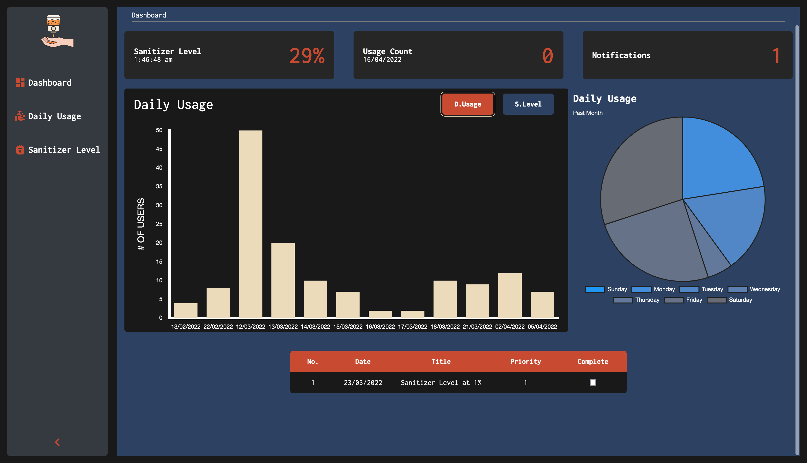

# Smart Automatic Hand Sanitizing Machine

# Capstone – Electrical and Electronics Engineering

_Ashesi University_

---

This repository is a part of the capstone project. It contains code for the server and front-end of the dashboard for the sanitizer system. The dashboard is used for visualization and analysis of usage data. The dashboard is also where notifications are shown before they are sent by email. The dashboard can also be used to view all usage history. The dashboard updates in realtime using [Socket.io](https://socket.io).

The usage data collected are:

1. **Sanitizer Level**: The level of the sanitizer in the tank.Taking periodically.
1. **Daily Usage**: The number of time s the device is used in a day.

The analytics section contains three graphs:

1. A [Bar](https://www.chartjs.org/docs/latest/charts/bar.html) graph showing the Daily usage.
1. A [Line](https://www.chartjs.org/docs/latest/charts/line.html) graph showing the sanitizer level of a set period.
1. A [Pie](https://www.chartjs.org/docs/latest/charts/doughnut.html) chart showing the number of times the device has been used on each weekday.

## Technologies Used

#### Front-End

1. [React](https://reactjs.org)
1. [SASS/SCSS](https://sass-lang.com)
1. [HTML/CSS](https://developer.mozilla.org/en-US/)
1. [Typescript](https://www.typescriptlang.org)
1. [Socket.io](https://socket.io)
1. [Chartjs](https://www.chartjs.org)

#### Server

1. [Express](https://expressjs.com)
1. [MongoDB](https://www.mongodb.com)
1. [Typescript](https://www.typescriptlang.org)
1. [Socket.io](https://socket.io)
1. [sendinblue](https://www.sendinblue.com)

## Hosting

The server is hosted on [heroku](https://www.heroku.com). Heroku is a hosting service that supports multiple languages. The client or React app is hosted on [Netlify](https://www.netlify.com). Netlify supports both fullstack and client only applications. The client connects to the server through the defined API.

**Application URL**: https://ahsm.netlify.app/

## Developer

**Gerald Addo-Tetteh**

- Work Email: addodevelop@gmail.com
- School Email: gerald.tetteh@ashesi.edu.gh
- [Website](https://gerald-addo.herokuapp.com)
- [LinkedIn](https://www.linkedin.com/in/gerald-addo-tetteh-a28101182/)
